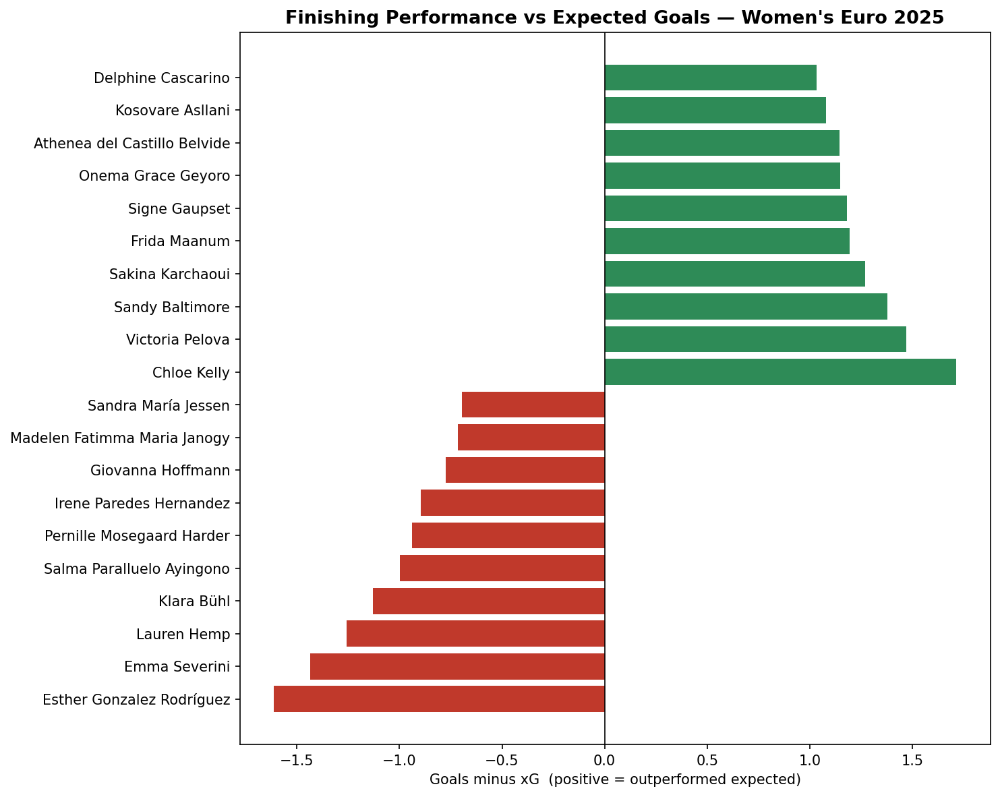

# womens-euro-2025-xg
Expected goals model and finishing analysis — Women's Euro 2025

# Expected Goals (xG) Model — Women's Euro 2025

A from-scratch expected goals model built on StatsBomb open data, used to analyse finishing performance at UEFA Women's Euro 2025.

## What this project does

- Builds an xG model using logistic regression, trained on 913 shots from the tournament
- Engineers two core features from raw shot coordinates: distance to goal and shot angle
- Applies the model to identify which players over- and under-performed their expected goals, a proxy for finishing skill

## Approach

Each shot's location was converted into two features: straight-line distance to the centre of the goal, and the angle of the goal mouth visible from the shot location. A logistic regression was trained to predict goal probability from these features. The model learned the expected relationships — goal probability falls with distance and rises with a wider angle — confirming it captures real finishing dynamics.

The model achieved a ROC-AUC of 0.74. This is solid for a two-feature model; a production model would add features such as assist type, defensive pressure, and whether the shot followed a dribble.

## Key finding

Summing each player's actual goals against their total xG reveals the tournament's most clinical finishers. Chloe Kelly led all players, scoring 3 goals from chances worth just 1.3 xG (+1.7), consistent with her reputation as a decisive attacking player.

## Limitations

- Two features only; real models use many more
- Small sample per player (minimum 5 shots applied to reduce noise)
- xG measures chance quality, not shot execution detail

## Tools

Python, pandas, scikit-learn, statsbombpy, mplsoccer, matplotlib. Data: StatsBomb Open Data.
